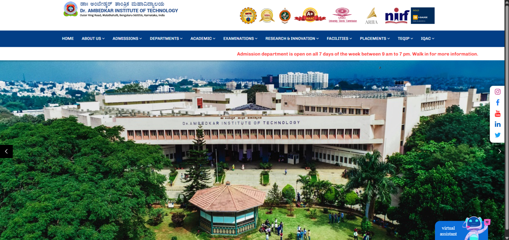
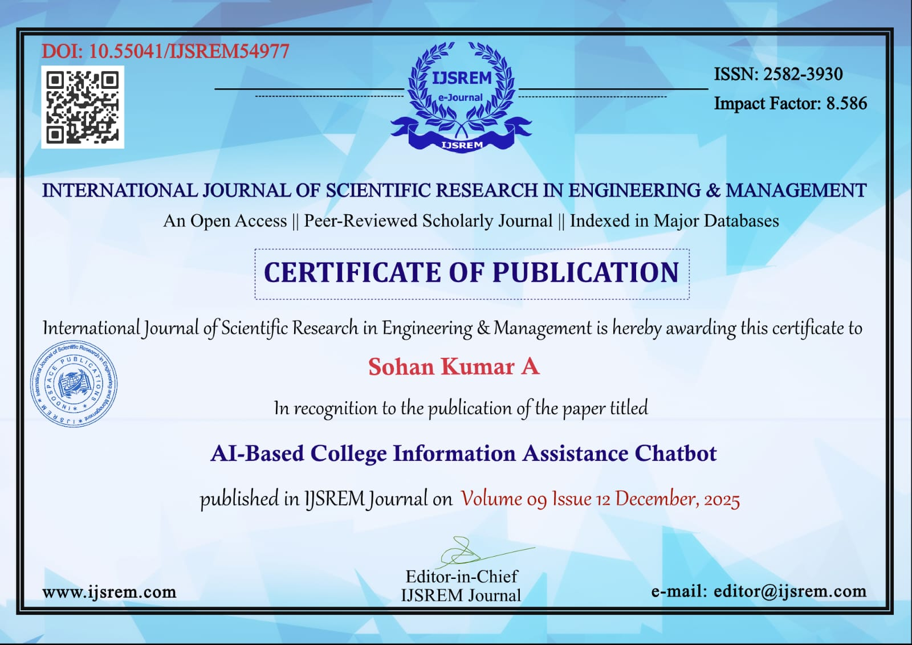

# 🤖 AI-Based College Information Assistance Chatbot

<h3 align="center">
🎓 Welcome to the AI-Based College Information Assistance Chatbot Repository 🎓
</h3>

<p align="center">
An AI-powered virtual assistant designed to help students, faculty, and administrators access college information instantly using Artificial Intelligence and Natural Language Processing.
</p>

<p align="center">
⭐ If you find this project useful, don't forget to Star this repository! ⭐
</p>

---

# 📖 About the Project

The **AI-Based College Information Assistance Chatbot** is an intelligent web application developed for **Dr. Ambedkar Institute of Technology**. It enables users to retrieve academic and administrative information through natural language conversations.

The chatbot leverages **Flask**, **SQLite**, **OpenRouter Large Language Models (LLMs)**, and **Natural Language Processing (NLP)** to provide an interactive, efficient, and user-friendly experience.

---

# ✨ Features

- 🤖 AI-Powered Chatbot
- 🎤 Voice Input (Speech-to-Text)
- 🔊 Voice Output (Text-to-Speech)
- 📚 Study Materials
- 📅 Timetable Information
- 📖 Syllabus Access
- 🎓 Student Result Retrieval
- 👨‍🏫 Faculty Information
- 📊 Attendance Management
- 🔐 Admin Portal
- 📰 Latest College Updates
- 🗄 SQLite Database Integration
- 💬 Natural Language Query Processing

---

# 🏗️ System Architecture

```text
                    +--------------------+
                    |       User         |
                    +---------+----------+
                              |
                              ▼
             +--------------------------------+
             | HTML | CSS | JavaScript Frontend |
             +----------------+---------------+
                              |
                              ▼
                     +----------------+
                     | Flask Backend  |
                     +--------+-------+
                              |
              +---------------+----------------+
              |                                |
              ▼                                ▼
      +---------------+             +----------------------+
      | SQLite DB     |             | OpenRouter AI (LLM) |
      +---------------+             +----------------------+
```

---

# 🛠️ Technologies Used

## Programming Languages

- Python
- HTML5
- CSS3
- JavaScript
- SQL

## Framework

- Flask

## Database

- SQLite

## Artificial Intelligence

- OpenRouter API
- Large Language Models (LLMs)
- Natural Language Processing (NLP)

## Hardware (Prototype)

- Raspberry Pi 4B
- USB Microphone
- Speaker

---

# 📂 Project Structure

```text
AI-based-college-information-assistance-chatbot/
│
├── screenshots/
├── static/
├── templates/
├── .env.example
├── .gitignore
├── Procfile
├── README.md
├── app.py
├── db3.db
└── requirements.txt
```

---

# 🚀 Installation

### Clone the Repository

```bash
git clone https://github.com/SohankumarA24/AI-based-college-information-assistance-chatbot.git
```

### Move into the Project Directory

```bash
cd AI-based-college-information-assistance-chatbot
```

### Install Dependencies

```bash
pip install -r requirements.txt
```

### Run the Application

```bash
python app.py
```

### Open in Browser

```
http://127.0.0.1:5000
```

---

# 🏠 Project Screenshot

<p align="center">

</p>

---

# 💡 Future Enhancements

- 🌐 ERP Integration
- 🌍 Multi-language Support
- 📱 Android & iOS Mobile Application
- 🔑 Student Authentication using SSO
- ☁️ Cloud Database Integration
- 📊 AI Analytics Dashboard
- 🤖 Personalized Student Assistant

---

# 📄 Research Publication

This project has been successfully published in the **International Journal of Scientific Research in Engineering & Management (IJSREM).**

## 📚 Publication Details

**Paper Title:**  
**AI-Based College Information Assistance Chatbot**

**Journal:** International Journal of Scientific Research in Engineering & Management (IJSREM)

**Volume:** 09

**Issue:** 12

**Publication Date:** December 2025

---

## 📜 Certificate of Publication

<p align="center">

</p>

---

# 👨‍💻 Authors

- **Sohan Kumar A**
- **Mohan D**
- **Naveen Araganji**
- **Nithin N J**

---

# ⭐ Support

If you found this project useful, please consider giving it a ⭐ on GitHub.

---

# 📬 Contact

**Author:** Sohan Kumar A

📧 Email: *sohankumar2580369@gmail.com*

🐙 GitHub: https://github.com/SohankumarA24

---

<p align="center">

### ❤️ Made with Flask • SQLite • OpenRouter AI • NLP ❤️

</p>
